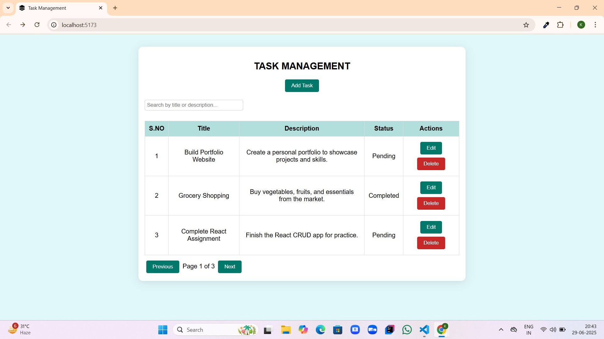
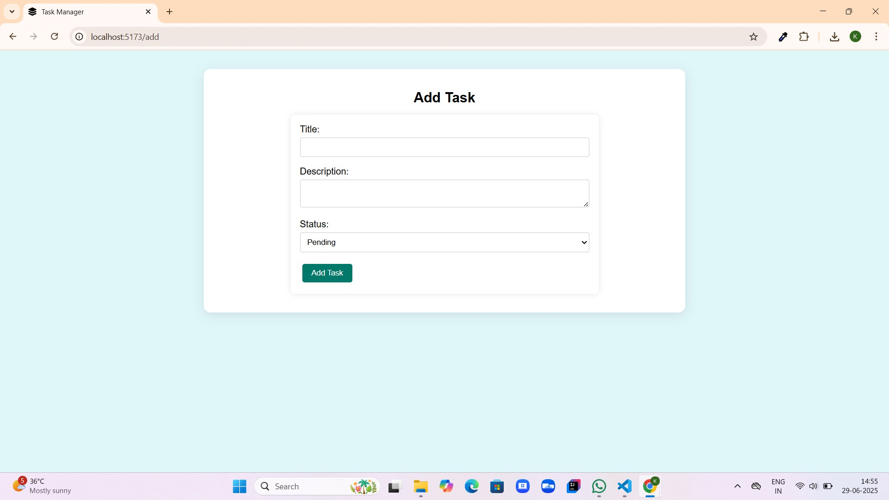
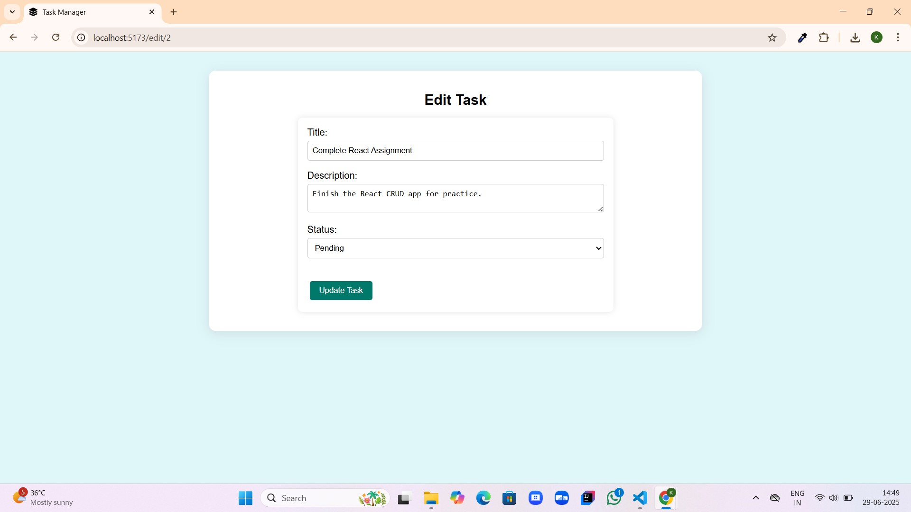
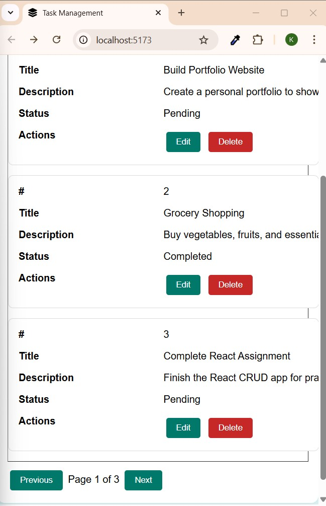

**Task Management App**

A fully responsive Task Management App built using React, Vite, and CSS, allowing you to Create, Read, Update, and Delete (CRUD) tasks with a clean, intuitive interface.

Features

🔹 Create, Read, Update, Delete (CRUD)
Add new tasks, view tasks in a table, edit existing tasks, and delete tasks easily.

🔹 Search and Filter
Live search tasks by title or description for quick filtering.

🔹 Sort Tasks
Sort tasks by Title or Status in ascending or descending order.

🔹 Pagination
Navigate tasks efficiently using Previous/Next pagination.

🔹 Local Storage Persistence
Tasks remain saved even after refreshing or closing the app.

🔹 Responsive Design
Works seamlessly on mobiles, tablets, and desktops.

🔹 Clean, Centered Layout
Pleasant, focused UI to enhance productivity and learning React.

🛠️ Technologies Used

React.js

Vite

React Router DOM

CSS

Local Storage

Responsive Web Design

📂 Folder Structure

Task-Manager/
│
├── public/
│   └── favicon.svg
│
├── src/
│   ├── assets/
│   │   └── Screenshots/
│   │       ├── Home.jpg
│   │       ├── AddTask.jpg
│   │       ├── EditTask.jpg
│   │       └── Responsive.jpg
│   │
│   ├── components/           # Reusable React components
│   │   ├── TaskForm.jsx
│   │   └── TaskTable.jsx
│   │
│   ├── pages/                # Route pages
│   │   ├── AddTask.jsx
│   │   ├── EditTask.jsx
│   │   └── Home.jsx
│   │
│   ├── App.jsx               # Main app file
│   ├── App.css               # Component styles
│   ├── index.css             # Global styles
│   └── main.jsx              # Entry point
│
├── .gitignore
├── index.html
├── package.json
├── package-lock.json
├── vite.config.js
├── eslint.config.js
└── README.md

CRUD Functionality

✅ Create: Add tasks with title, description, and status.
✅ Read: View tasks in a sortable, searchable table with pagination.
✅ Update: Edit tasks using the update form and route.
✅ Delete: Remove tasks with a single click.

Usage
✨ Add Tasks: Navigate to "Add Task," fill in details, and submit.
✨ Edit Tasks: Click "Edit" on any task to update its details.
✨ Delete Tasks: Click "Delete" to remove tasks instantly.
✨ Search: Type in the search bar to filter tasks by title or description.
✨ Sort: Click "Title" or "Status" headers to sort.
✨ Paginate: Navigate between pages for better management.

## Screenshots

### 1. Home Page 

### 2. Add Task Page 

### 3. Edit Task Page

### 4. Responsive Layout

## Author

Developed by [Karthiga P](https://github.com/KarthigaP20)

## Live Demo

Visit the live site: [Task Management Website](https://taskmanager-karthiga.vercel.app/)

Feedback
Thank you for checking out this project.
Feel free to open issues or suggest improvements.

Made with React, Vite, and CSS.

